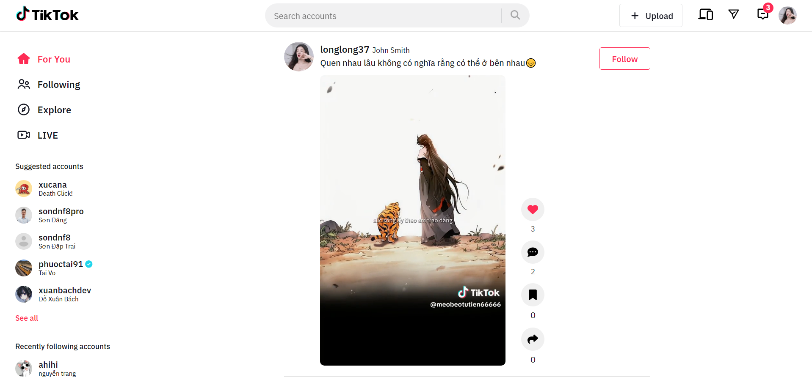

<h1 align="center" style="font-size: 60px">Tiktok Clone</h1>

<strong>This is a project to clone the user page of the social network TikTok.</strong>

  
  
  

### Live demo: 

[tiktok-clone-ten-iota.vercel.app](tiktok-clone-ten-iota.vercel.app)

### Features

- Sign in, sign up by account, Google
- Autoplay video on scroll
- Infinite scroll video
- Like, comment video
- Customize video player interface
- Upload video
- Update personal profile
- Search account by name
- Paginate search result
- Follow, unfollow any account
- Following account
- Suggested account
- Following video page
- Multi-language support
- Basic responsive
- Separate protected route and public route
- Validate form with Yup and React Hook Form
- SEO with React Helmet

### Technology

- ReactJS
- Rest API
- React Router DOM
- React Hook Form
- React Query
- React Helmet
- Eslint
- Prettier
- ...

### Preview

